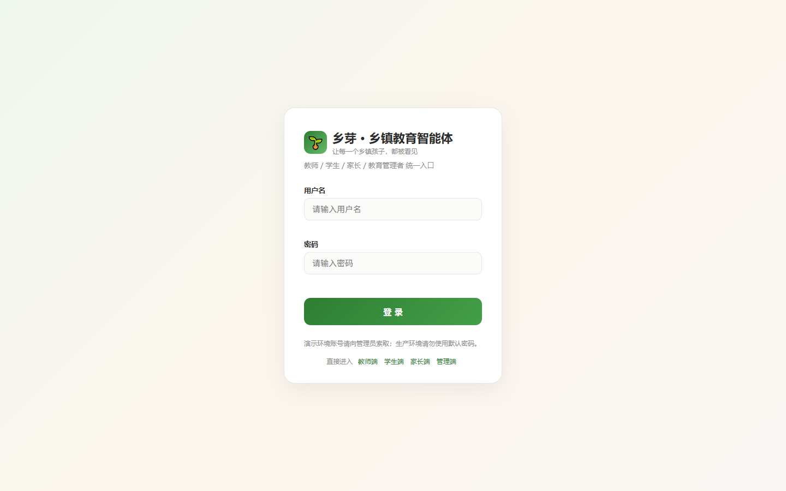
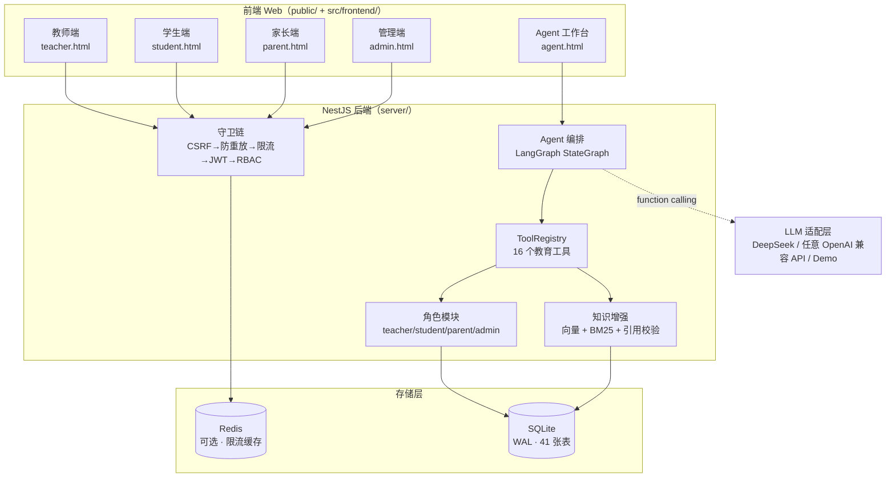
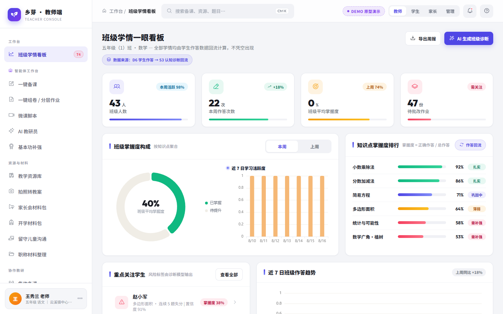
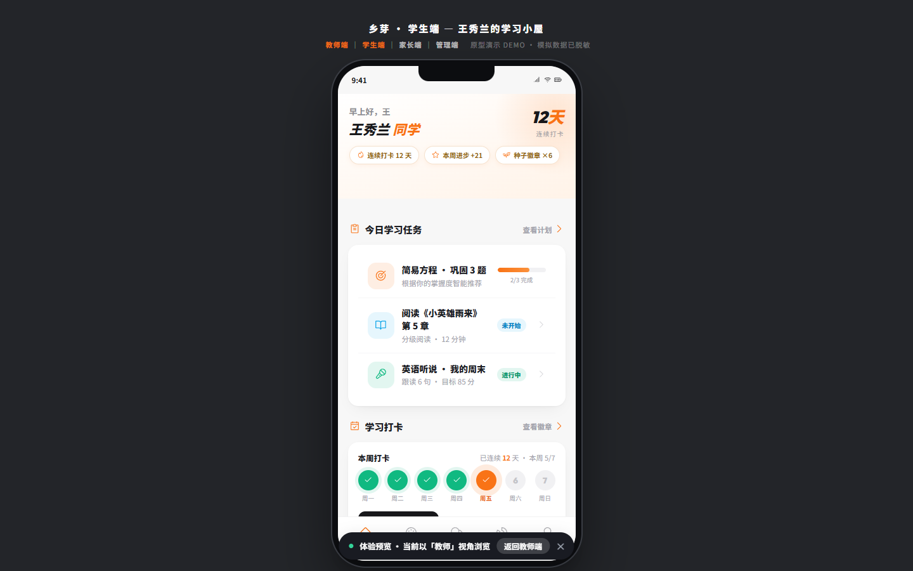
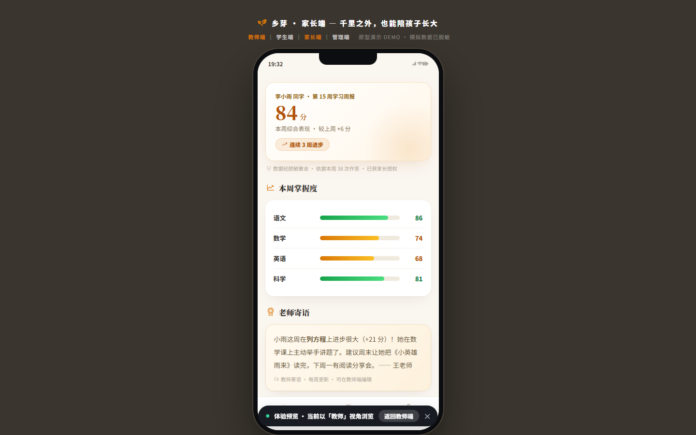
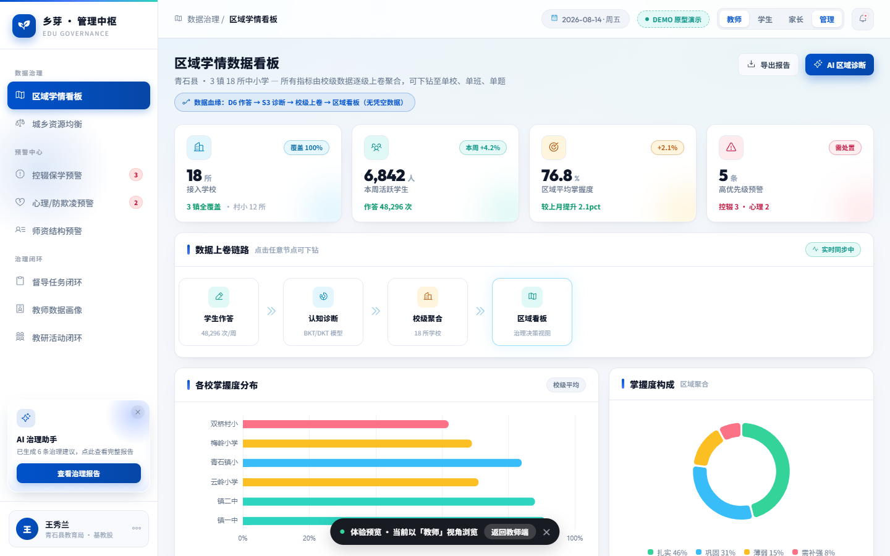
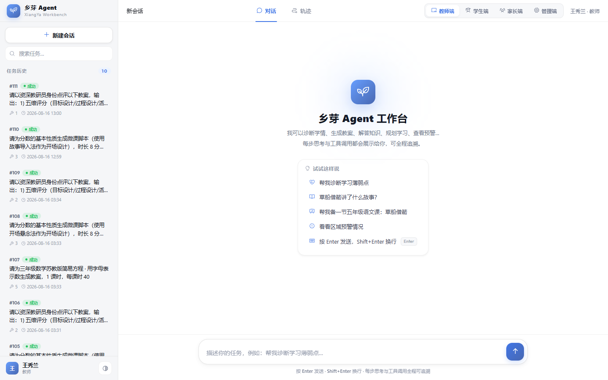

<div align="center">

# 🌱 乡芽 · 乡镇教育智能体

**面向乡镇学校的 AI 教育智能体 —— 教师 / 学生 / 家长 / 管理 四端一库，覆盖备授课、学情、家校、区域治理全链路**

`NestJS` · `LangGraph` · `SQLite` · `DeepSeek` · `TypeScript`


</div>

---

## 📖 项目简介

**乡芽**是一个面向乡镇学校的 AI 教育智能体。它围绕乡镇教育真实的业务场景，将 **教师备课授课、学生个性化学习、家长家校共育、区域教育治理** 四大角色聚合到一个系统中，并通过一个 **可观测、可追溯的 Agent 工作台** 统一编排 AI 能力。

> 🧠 没有大模型 Key 也能完整演示——系统内置 **Demo 规则引擎**，接入任意 OpenAI 兼容服务（如 DeepSeek）后自动切换为真实 AI 生成。



---

## ✨ 核心亮点

| 亮点 | 说明 |
|---|---|
| 🤖 **Agent 工作台** | 思考块 → 工具卡片 → 流式文本 → 引用 refs → 全链路轨迹回放，AI 过程完全透明 |
| 🧩 **16 个教育工具** | 诊断 / 错题 / 计划 / 备课 / 组卷 / 点评 / 预警…… 带 JSON Schema + 角色权限 |
| 🏗 **LangGraph 编排** | ReAct 循环 + SQLite checkpoint 记忆，多轮会话上下文保持 |
| 📐 **算法引擎** | BKT 贝叶斯知识追踪、ZPD 最近发展区、苏格拉底五阶段状态机 |
| 🔒 **企业级安全** | JWT + RBAC + CSRF + 防重放签名 + 限流 + 上传魔数校验，11/11 安全自检通过 |
| 📈 **零配置演示** | SQLite 内置、无 LLM Key 可跑、自动降级，开箱即用 |

---

## 🗺 四端一库架构



---

## 🎯 功能总览

### 🧑‍🏫 教师端

- **AI 助手**：一键教案生成、教研员点评、讲题话术、教学建议
- **备课工作台**：一键组卷（含答案与解析）、试卷布置与导出、微课脚本
- **学情管理**：班级概览、知识点掌握度、风险学生识别
- **日常工作**：发言稿、开学返校包、技能自评、职称材料分类
- **协作备课**：备课组、协作计划、动态 feed
- **家校共建**：知识库、OCR 转教案



### 🧒 学生端

- **学习计划**：AI 生成个性化每日计划，步骤式作答实时反馈
- **学情诊断**：薄弱点定位、错题本、兴趣画像、每日打卡
- **苏格拉底辅导**：追问式引导，不直接给答案，培养解题能力
- **知识问答**：教材问答（RAG 引用可信来源，拒绝编造）
- **听说练习**：朗读练习、听说成绩、书库自测



### 👨‍👩‍👧 家长端

- **学情周报**：出勤、作业、知识点掌握的每周可视化报告
- **育儿建议**：AI 育儿话术（如「孩子成绩下滑怎么办」）
- **语音留言**：与老师的异步沟通
- **亲子课程**：课程列表与完成进度



### 🏛 管理端

- **区域看板**：学校覆盖、学段分布、周作答趋势
- **资源均衡**：教师 / 教室 / 经费缺口清单（含师生比）
- **预警处置**：控辍保学、师资、学生风险预警闭环
- **督导教研**：督导任务、教师画像、教研活动、审计日志



### 🤖 Agent 工作台（统一入口）

登录后四端角色统一进入工作台，以**自然语言**驱动 AI 完成跨模块任务：

```
输入任务 → 意图识别（规则 + LLM 双通道）
        → ReAct 循环（LLM 决策 → 工具执行 → 结果回填，≤12 轮）
        → 引用校验（防幻觉）
        → 交付（流式文本 + 结构化报告 + refs）
```

- 🧠 **思考块**：可折叠的 AI 推理过程
- 🛠 **工具卡片**：每次工具调用的参数 / 结果 / 耗时 / 状态色
- 📜 **轨迹侧栏**：全链路 trace 回放，供审计与演示
- 💾 **任务历史**：左侧历史会话，随点随续



---

## 🧩 Agent 核心能力

| 能力 | 实现 | 验证 |
|---|---|---|
| 任务理解 | 规则引擎 + LLM 意图解析（8 条系统规则） | 四端 5 类任务正确路由 ✅ |
| 计划生成 | ReAct 循环自主拆解多步计划 | 复合任务一次调用 3 个工具 ✅ |
| 多轮交互 | checkpoint-sqlite 记忆 + 苏格拉底状态机 | 追问上下文保持 ✅ |
| 工具调用 | 16 个工具，JSON Schema + 权限 + 超时 + 轨迹 | 四端真实调用并落库 ✅ |
| 知识增强 | 向量 + BM25 双路召回 → RRF 融合 → 引用校验 | 《草船借箭》7 chunk 引用 ✅ |
| 记忆 | 独立 checkpoint 文件 + 全量轨迹 | 故障降级重试 ✅ |
| 结果验证 | refs 校验 + run 状态机 + trace 回放 | runDetail 逐条回放 ✅ |

**实测用例**：`"帮我诊断一下我的学习薄弱点"`、`"《草船借箭》讲了什么？"`、`"生成一份五年级语文《草船借箭》教案"`、`"看看区域学情和预警"`

---

## 🛠 技术栈

| 层 | 技术 |
|---|---|
| 前端 | 原生 HTML + TypeScript（esbuild 构建）· 无框架依赖 |
| 后端 | NestJS 10 · TypeORM · class-validator |
| Agent | LangGraph.js 1.4 · @langchain/openai |
| 模型 | DeepSeek `deepseek-chat`（OpenAI 兼容，function calling）· 可选通义 embedding |
| 数据库 | SQLite（better-sqlite3，WAL）· 41 张业务表 + FTS5 全文索引 |
| 算法 | BKT 贝叶斯知识追踪 · ZPD 最近发展区 · 苏格拉底状态机 |
| 文档 | docx · pptxgenjs · pdf-lib · exceljs（AI 生成 Office 文件） |
| 缓存 | Redis（可选，未启用时内存降级） |

---

## 🚀 快速开始

### 环境要求

- Node.js ≥ 18（验证环境 20.18.0）
- SQLite 内置，零安装

### 安装与构建

```bash
# 1. 后端依赖
cd server
npm install

# 2. 前端构建依赖（项目根目录）
cd ..
npm install --save-dev esbuild puppeteer-core

# 3. 构建后端
cd server
npm run build

# 4. 构建前端（将签名密钥注入前端 bundle）
cd ..
node build-frontend.mjs
```

### 配置环境变量

```bash
cd server
cp .env.example .env   # 按需修改 PORT / JWT_SECRET / SIGNING_SECRET
```

> ⚠️ 生产环境务必替换 `JWT_SECRET` 与 `SIGNING_SECRET` 为强随机值。

### 启动

```bash
cd server
node dist/main.js
# 或生产：pm2 start dist/main.js --name xiangya
```

访问 `http://localhost:3000/login.html`，健康检查：`GET /api/v1/system/health`

### 接入真实 AI（可选）

编辑 `server/.env`：

```env
LLM_PROVIDER=openai-compatible
LLM_BASE_URL=https://api.deepseek.com/v1
LLM_API_KEY=your-deepseek-api-key
LLM_MODEL=deepseek-chat
```

不配置时自动降级为 **Demo 规则引擎**，功能完整、零成本演示。

### 演示账号

| 角色 | 用户名 | 密码 |
|---|---|---|
| 教师 | `wangxiulan` | `Demo@2026xy` |
| 学生 | `lixiaoyu` | `Demo@2026xy` |
| 家长 | `lijiangguo` | `Demo@2026xy` |
| 管理端 | `zhoujuzhang` | `Admin@2026Xy` |

---

## 📁 目录结构

```
educate-agent/
├── server/                 # NestJS 后端
│   ├── src/
│   │   ├── modules/        # agent / teacher / student / parent / admin ...
│   │   ├── db/             # TypeORM 实体 + 种子数据
│   │   └── common/         # 守卫 / 装饰器 / 工具（安全基建）
│   └── .env.example        # 环境变量模板
├── public/                 # 前端静态页面（4 端 + 工作台）
├── src/frontend/           # 前端 TS 源码（core/ + entries/）
├── scripts/                # 构建与验收脚本
├── docs/                   # 设计 / API / 安全 / 测试 / 部署文档
├── build-frontend.mjs      # 前端构建脚本
└── start.bat               # Windows 一键启动
```

---

## 📚 文档

| 文档 | 说明 |
|---|---|
| [API 接口文档](docs/API接口文档.md) | 全部端点、错误码、安全头规范 |
| [安全设计说明](docs/安全设计说明.md) | 威胁模型、守卫链、自检结论 |
| [Agent 应用能力清单](docs/Agent应用能力清单.md) | 六项 Agent 能力对照实现 |
| [部署手册](docs/部署手册.md) | Nginx、PM2、环境变量 |
| [测试报告](docs/测试报告.md) | 39 单测 + 20 E2E + 11 安全自检 |
| [演示脚本](docs/演示脚本.md) | 15 分钟四端演示流程 |

---

## 🔒 安全设计速览

```
CsrfGuard → ReplayGuard → RateLimitGuard → JwtAuthGuard → RbacGuard
```

- **认证**：JWT 短时 Access + HttpOnly Refresh Cookie + 会话管理
- **CSRF**：双提交 Cookie + 自定义头，登录后 Cookie 轮换
- **防重放**：时间戳窗口 5 分钟 + 一次性 Nonce + HMAC 签名
- **上传防护**：扩展名白名单 + **魔数校验**（伪装扩展名直接拒绝）
- **未成年人保护**：学生数据仅本人 / 监护教师 / 绑定家长可见；不给学生直接答案
- **防越权**：全局 RBAC + 数据域校验（班主任 / 家长关系 / 管理员）

> 安全自检 **11/11** 通过：SQL 注入、XSS、伪装上传、CSRF、重放、Token 篡改、越权、爆破限流全部拦截。

---

<div align="center">

**乡芽 —— 让 AI 教育智能体，扎根乡镇课堂 🌱**

</div>